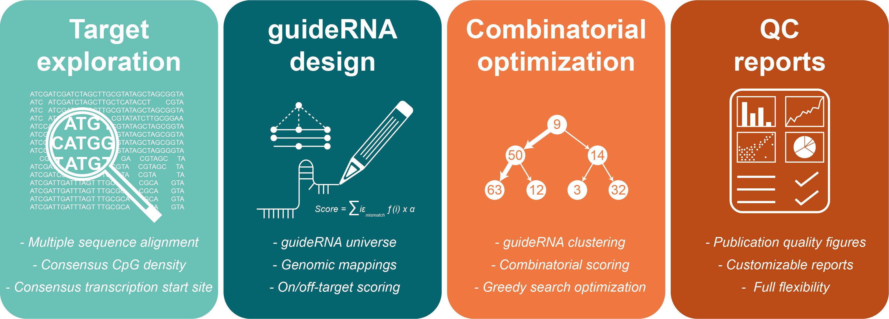

Repguide
========

The Repguide R package is a pre-alpha development version to facilitate
the design of guideRNAs for CRISPR/dCas9 targeting of repetitive DNA
sequences, such as those derived from transposable elements. The basic
workflow consists of selecting the target sites, computing and scoring
guideRNAs, and finding the optimal combination of multiple guides to
maximize and minimize on- and off-targeting, respectively. More details
on the usage of the workflow is available in the package
[vignette](https://tanaylab.bitbucket.io/Repguide/articles/Repguide.html).

#### Functionality




#### Installation

``` r
# Install BiocManager, devtools, and tgstat (in case you haven't already)
install.packages('BiocManager')
install.packages('devtools')
install.packages('tgstat', repos=c(getOption('repos'), 'https://tanaylab.bitbucket.io/repo'))

# Install Repguide
options(repos = c(getOption("repos"), BiocManager::repositories()))
devtools::install_bitbucket('tanaylab/repguide', ref='default')
```

**Note**: Repguide currently requires Unix environment. In particular it
uses the Tanay group tgstat library that utilizes shared memory and
distributed computing (as well as some specific optional CPU features).
